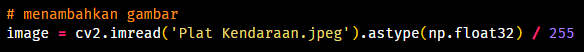
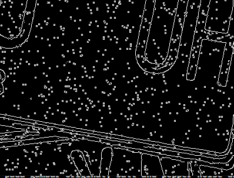
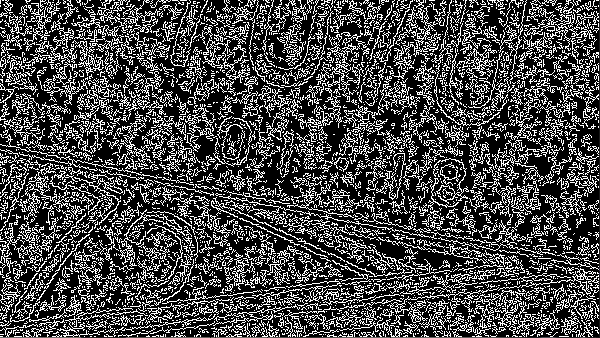
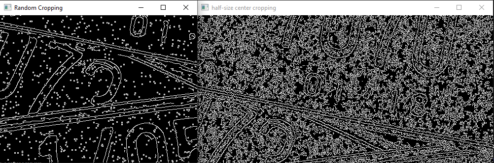
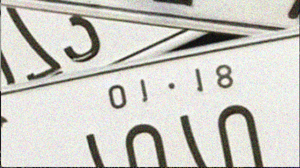
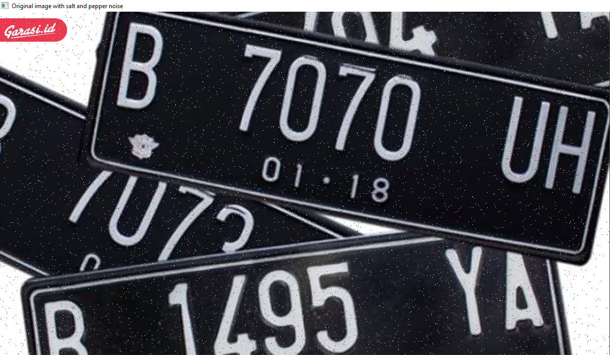
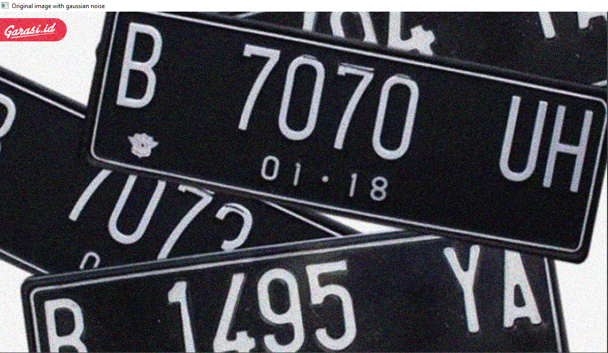
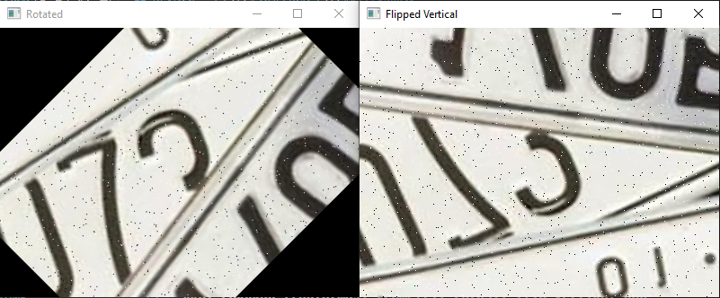
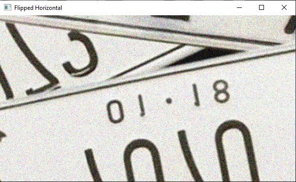

# QUIZ PCD

## Muhammad Awan Ardy Firmansyah

## F55120041

**1. baca gambar menggunakan opencv dan pil**

**2. Lakukan edge detection menggunakan sobel dan canny**

**3. Lakukan cropping random cropping dan half-size center cropping**

**4. Lakukan transformasi pada gambar putih jadi hitam dan hitam jadi putih**

**5. Tambahkan noise pada gambar original; salt and pepper noise dan gaussian**

**6. Lakukan tranformasi geometri; rotasi, flip vertikal dan horizontal**

